Importing all the libraries that we will use:


```python
import pandas as pd
import numpy as np
import matplotlib.pyplot as plt
from numpy import nan as NaN
from sklearn.preprocessing import LabelEncoder
from sklearn.cross_validation import KFold   #For K-fold cross validation
from sklearn.tree import DecisionTreeClassifier, export_graphviz
from sklearn import metrics
import csv
#classifiers
from sklearn.linear_model import LogisticRegression
from sklearn.ensemble import RandomForestClassifier
import sklearn.naive_bayes as nb
from sklearn.ensemble import AdaBoostClassifier
from sklearn.svm import SVC
from sklearn.linear_model import SGDClassifier
```

Read the dataset using function read_csv(). We will read both train and test data, because we want to preprocess all our data the same.


```python
train_df = pd.read_csv("./data/train.csv") #Reading the dataset in a dataframe using Pandas
test_df = pd.read_csv("./data/test.csv")
test_df['Loan_Status'] = NaN
frames = [train_df,test_df]
df = pd.concat(frames, ignore_index = True)
```

## Distribution analysis

Now that we are familiar with basic data characteristics, let us study distribution of various variables. Let us start with numeric variables – namely ApplicantIncome and LoanAmount

Lets start by plotting the histogram of ApplicantIncome using the following commands:


```python
df['ApplicantIncome'].hist(bins=50)
plt.show()
```


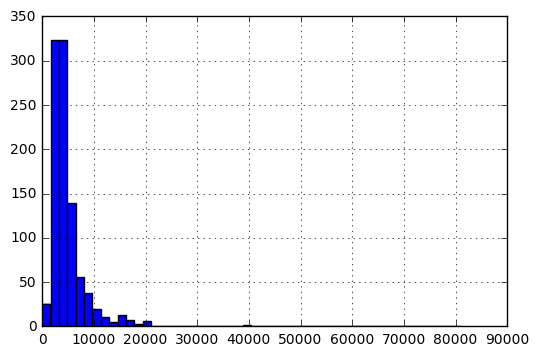


Here we observe that there are few extreme values. This is also the reason why 50 bins are required to depict the distribution clearly.

Next, we look at box plots to understand the distributions. Box plot can be plotted by:


```python
df.boxplot(column='ApplicantIncome')
plt.show()
```

    C:\Users\matoo\Anaconda2\lib\site-packages\ipykernel\__main__.py:1: FutureWarning: 
    The default value for 'return_type' will change to 'axes' in a future release.
     To use the future behavior now, set return_type='axes'.
     To keep the previous behavior and silence this warning, set return_type='dict'.
      if __name__ == '__main__':
    


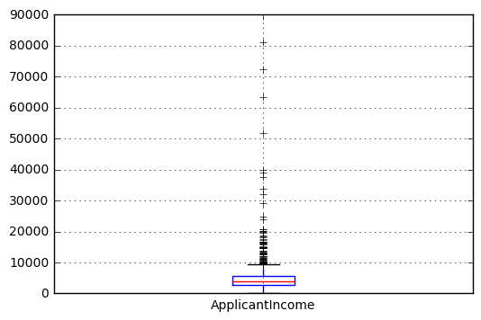


This confirms the presence of a lot of outliers/extreme values. This can be attributed to the income disparity in the society. Part of this can be driven by the fact that we are looking at people with different education levels. Let us segregate them by Education:


```python
df.boxplot(column='ApplicantIncome', by = 'Education')
plt.show()
```


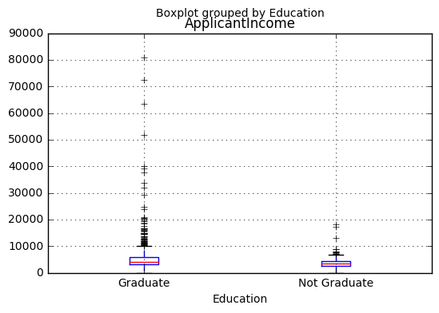


We can see that there is no substantial different between the mean income of graduate and non-graduates. But there are a higher number of graduates with very high incomes, which are appearing to be the outliers.

# Task 2: Distribution Analysis


```python
df['LoanAmount'].hist(bins=50)
plt.show()
```


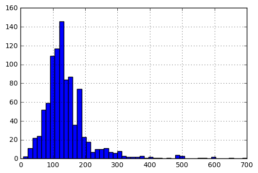


```python
df.boxplot(column='LoanAmount')
plt.show()
```

    C:\Users\matoo\Anaconda2\lib\site-packages\ipykernel\__main__.py:1: FutureWarning: 
    The default value for 'return_type' will change to 'axes' in a future release.
     To use the future behavior now, set return_type='axes'.
     To keep the previous behavior and silence this warning, set return_type='dict'.
      if __name__ == '__main__':
    


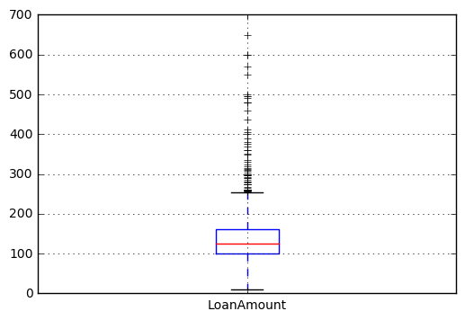


Again, there are some extreme values. Clearly, both ApplicantIncome and LoanAmount require some amount of data munging. LoanAmount has missing and well as extreme values values, while ApplicantIncome has a few extreme values, which demand deeper understanding. We will take this up in coming sections.

## Categorical variable analysis

Frequency Table for Credit History:


```python
temp1 = df['Credit_History'].value_counts(ascending=True)
temp1
```


    0.0    148
    1.0    754
    Name: Credit_History, dtype: int64


Probability of getting loan for each Credit History class:


```python
temp2 = df.pivot_table(values='Loan_Status',index=['Credit_History'],aggfunc=lambda x: x.map({'Y':1,'N':0}).mean())
temp2
```


    Credit_History
    0.0    0.078652
    1.0    0.795789
    Name: Loan_Status, dtype: float64


This can be plotted as a bar chart using the “matplotlib” library with following code:


```python
fig = plt.figure(figsize=(8,4))
ax1 = fig.add_subplot(121)
ax1.set_xlabel('Credit_History')
ax1.set_ylabel('Count of Applicants')
ax1.set_title("Applicants by Credit_History")
temp1.plot(kind='bar')

ax2 = fig.add_subplot(122)
temp2.plot(kind = 'bar')
ax2.set_xlabel('Credit_History')
ax2.set_ylabel('Probability of getting loan')
ax2.set_title("Probability of getting loan by credit history")

plt.show()
```


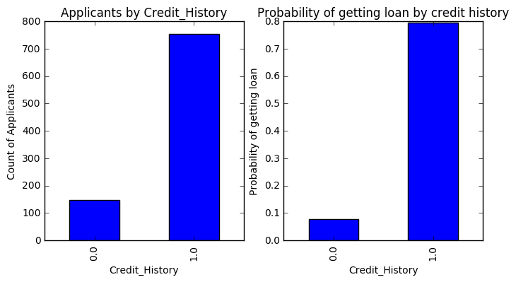


These three plots shows us 'Loan_Status' according to different featurs in a stacked chart:


```python
temp3 = pd.crosstab(index= df['Credit_History'], columns = df['Loan_Status'])
temp3.plot(kind='bar', stacked=True, color=['red','blue'], grid=False)
ax3 = fig.add_subplot(131)
ax3.set_title("Loan_Status by Credit_History")
temp4 = pd.crosstab(df['Education'], df['Loan_Status'])
temp4.plot(kind='bar', stacked=True, color=['red','blue'], grid=False)
ax4 = fig.add_subplot(132)
ax4.set_title("Loan_Status by Education")
temp5 = pd.crosstab(df['Self_Employed'], df['Loan_Status'])
temp5.plot(kind='bar', stacked=True, color=['red','blue'], grid=False)
ax5 = fig.add_subplot(133)
ax5.set_title("Loan_Status by Self_Employed")
plt.show()
```


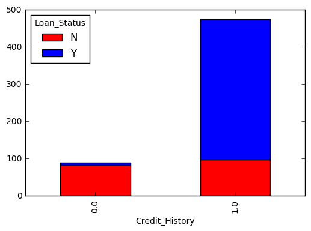


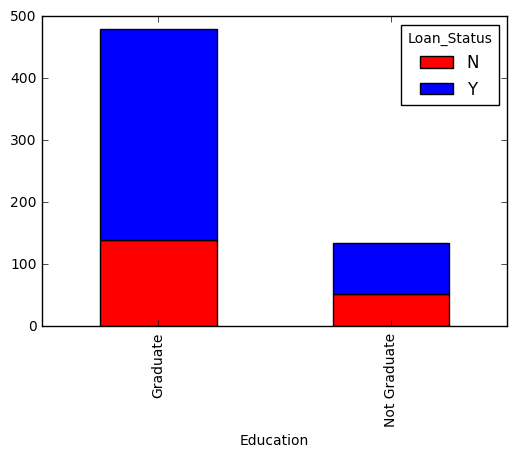


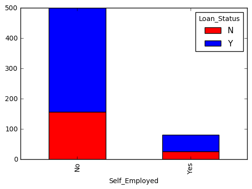


We can see that 'Education' doesn't tell us weather the loan will be approved bcause 'Loan_status' in each bar is ~50% yes.
We can see that 'Credit_History' is very significant.

## How to fill missing values?


```python
df.isnull().sum()
```


    Loan_ID                0
    Gender                24
    Married                3
    Dependents            25
    Education              0
    Self_Employed          0
    ApplicantIncome        0
    CoapplicantIncome      0
    LoanAmount             0
    Loan_Amount_Term      20
    Credit_History        79
    Property_Area          0
    Loan_Status          367
    LoanAmount_log         0
    TotalIncome            0
    TotalIncome_log        0
    dtype: int64


Self_Employed has some missing values. Let’s look at the frequency table:


```python
df['Self_Employed'].value_counts()
```


    No     807
    Yes    119
    Name: Self_Employed, dtype: int64


Since ~87% values are “No”, it is safe to impute the missing values as “No” as there is a high probability of success. This can be done using the following code:


```python
df['Self_Employed'].fillna('No',inplace=True)
```

Now, we will create a Pivot table, which provides us median values for all the groups of unique values of Self_Employed and Education features. Next, we define a function, which returns the values of these cells and apply it to fill the missing values of loan amount:


```python
table = df.pivot_table(values='LoanAmount', index='Self_Employed' ,columns='Education', aggfunc=np.median)
table
```


<div>
<table border="1" class="dataframe">
  <thead>
    <tr style="text-align: right;">
      <th>Education</th>
      <th>Graduate</th>
      <th>Not Graduate</th>
    </tr>
    <tr>
      <th>Self_Employed</th>
      <th></th>
      <th></th>
    </tr>
  </thead>
  <tbody>
    <tr>
      <th>No</th>
      <td>130.0</td>
      <td>117.0</td>
    </tr>
    <tr>
      <th>Yes</th>
      <td>150.0</td>
      <td>130.0</td>
    </tr>
  </tbody>
</table>
</div>


Define function to return value of this pivot_table:


```python
def fage(x):
     return table.loc[x['Self_Employed'],x['Education']]
```

Replace missing values:


```python
df['LoanAmount'].fillna(df[df['LoanAmount'].isnull()].apply(fage, axis=1), inplace=True)
```

This should provide you a good way to impute missing values of loan amount.

## How to treat for extreme values in distribution of LoanAmount and ApplicantIncome?

Let’s analyze LoanAmount first. Since the extreme values are practically possible, i.e. some people might apply for high value loans due to specific needs. So instead of treating them as outliers, let’s try a log transformation to nullify their effect:


```python
df['LoanAmount'].hist(bins=20)
plt.show()
```


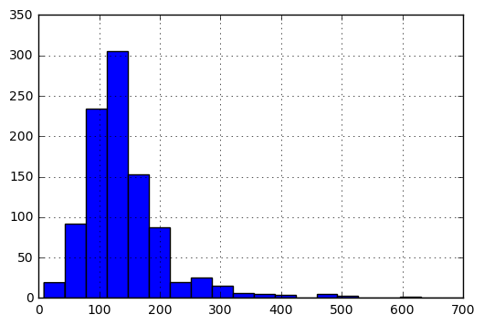


```python
df['LoanAmount_log'] = np.log(df['LoanAmount'])
df['LoanAmount_log'].hist(bins=20)
plt.show()
```


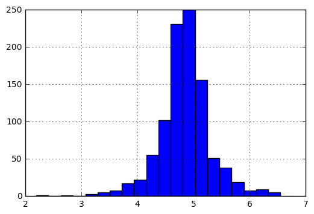


Now the distribution looks much closer to normal and effect of extreme values has been significantly subsided.

Coming to ApplicantIncome. One intuition can be that some applicants have lower income but strong support Co-applicants. So it might be a good idea to combine both incomes as total income and take a log transformation of the same.


```python
df['TotalIncome'] = df['ApplicantIncome'] + df['CoapplicantIncome']
df['TotalIncome_log'] = np.log(df['TotalIncome'])
df['TotalIncome_log'].hist(bins=20) 
plt.show()
```


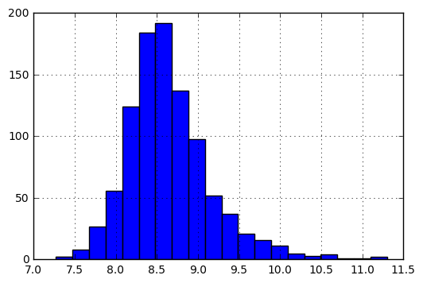


Now we see that the distribution is much better than before. 

# Remove nulls

For these three predictors, we choose to fill NaNs with the common value:


```python
df['Loan_Amount_Term'].fillna(360, inplace=True)
```


```python
df['Dependents'].value_counts()
```


    0     545
    2     160
    1     160
    3+     91
    Name: Dependents, dtype: int64


```python
df['Dependents'].fillna(0, inplace=True)
```


```python
df['Credit_History'].value_counts()
df['Credit_History'].fillna(1, inplace=True)
```


```python
def fill_data_with_dist(feature_name, rate, first, second):
    indices = [i for i, x in enumerate(df[feature_name]) if x is NaN]
    fill_first = indices[:int(rate * len(indices))]
    fill_second =indices[int(rate * len(indices)):]
    for index in fill_first:
        df.set_value(index, feature_name, first)
    for index in fill_second:
        df.set_value(index, feature_name, second)
```

We want to complete the 'Married' and 'Gender' featurs according to the distribution in the datas and not according to the majority.


```python
married = df['Married'].value_counts()
print married
married_rate = married[0]/float(married[0]+married[1])
fill_data_with_dist('Married', married_rate, 'Yes', 'No')
```

    Yes    631
    No     347
    Name: Married, dtype: int64
    [104]
    [228, 435]
    


```python
gender = df['Gender'].value_counts()
print gender
male_rete = gender[0]/float(gender[0]+gender[1])
fill_data_with_dist('Gender', married_rate, 'Male', 'Female')
```

    Male      775
    Female    182
    Name: Gender, dtype: int64
    [23, 126, 171, 188, 314, 334, 460, 467, 477, 507, 576, 588, 592, 636, 665]
    [720, 752, 823, 845, 859, 893, 910, 917, 932]
    

Next, we will look at making predictive models.

# Building a Predictive Model in Python

After, we have made the data useful for modeling, let’s now look at the python code to create a predictive model on our data set. Skicit-Learn (sklearn) is the most commonly used library in Python for this purpose and we will follow the trail.

Since, sklearn requires all inputs to be numeric, we should convert all our categorical variables into numeric by encoding the categories. This can be done using the following code:


```python
var_mod = ['Gender','Married','Dependents','Education','Self_Employed','Property_Area','Loan_Status']
le = LabelEncoder()
for i in var_mod:
    df[i] = le.fit_transform(df[i].astype(str))
```

now we will split the DF into train and test again


```python
train_df = df[:614]
test_df = df[614:]
pred_df = pd.DataFrame(index = test_df['Loan_ID'], columns = ['Loan_Status'])
test_df.drop(['Loan_Status','Loan_ID'], axis=1, inplace=True)
#test_df.drop('Loan_ID', axis=1, inplace=True)
```

    C:\Users\matoo\Anaconda2\lib\site-packages\ipykernel\__main__.py:4: SettingWithCopyWarning: 
    A value is trying to be set on a copy of a slice from a DataFrame
    
    See the caveats in the documentation: http://pandas.pydata.org/pandas-docs/stable/indexing.html#indexing-view-versus-copy
    

Next, we will import the required modules. Then we will define a generic classification function, which takes a model as input and determines the Accuracy and Cross-Validation scores. 


```python
#Generic function for making a classification model and accessing performance:
def classification_model(model, data, predictors, outcome):
    #Fit the model:
    model.fit(data[predictors],data[outcome])

    #Make predictions on training set:
    predictions = model.predict(data[predictors])

    #Print accuracy
    accuracy = metrics.accuracy_score(predictions,data[outcome])
    print("Accuracy : %s" % "{0:.3%}".format(accuracy))

    #Perform k-fold cross-validation with 5 folds
    kf = KFold(data.shape[0], n_folds=5)
    error = []
    for train, test in kf:
        # Filter training data
        train_predictors = (data[predictors].iloc[train,:])
  
        # The target we're using to train the algorithm.
        train_target = data[outcome].iloc[train]
  
        # Training the algorithm using the predictors and target.
        model.fit(train_predictors, train_target)
  
        #Record error from each cross-validation run
        error.append(model.score(data[predictors].iloc[test,:], data[outcome].iloc[test]))

    print("Cross-Validation Score : %s" % "{0:.3%}".format(np.mean(error)))

    #Fit the model again so that it can be refered outside the function:
    model.fit(data[predictors],data[outcome]) 

    return model.predict(test_df[predictors])
```

A function that will help us to write the prediction in an excel workbook:


```python
def write_csv(prediction, name):
    prediction=prediction.replace({'Loan_Status': {0: 'N'}}) 
    prediction=prediction.replace({'Loan_Status': {1: 'Y'}}) 
    prediction.to_csv("./results/"+ name +".csv")
```

## Logistic Regression


```python
outcome_var = 'Loan_Status'
model = LogisticRegression()
predictor_var = ['Credit_History']
pred_df['Loan_Status'] = classification_model(model, train_df, predictor_var, outcome_var)
```

    Accuracy : 80.945%
    Cross-Validation Score : 80.946%
    

We can try different combination of variables:


```python
predictor_var = ['Credit_History','Education','Married','Self_Employed','Property_Area']
pred_df['Loan_Status'] = classification_model(model, train_df, predictor_var, outcome_var)
write_csv(pred_df, "Logistic Regression")
```

    Accuracy : 80.945%
    Cross-Validation Score : 80.946%
    

## Decision Tree

Decision tree is another method for making a predictive model. It is known to provide higher accuracy than logistic regression model. 


```python
model = DecisionTreeClassifier()
predictor_var = ['Credit_History','Gender','Married','Education']
pred_df['Loan_Status'] = classification_model(model, train_df, predictor_var, outcome_var)
write_csv(pred_df, "DT1")
```

    Accuracy : 80.945%
    Cross-Validation Score : 80.946%
    

Here the model based on categorical variables is unable to have an impact because Credit History is dominating over them. Let’s try a few numerical variables:


```python
#We can try different combination of variables:
predictor_var = ['Credit_History','Loan_Amount_Term','LoanAmount_log']
pred_df['Loan_Status'] = classification_model(model, train_df,predictor_var,outcome_var)
write_csv(pred_df, "DT2")
```

    Accuracy : 89.251%
    Cross-Validation Score : 69.538%
    

## Random Forest

Random forest is another algorithm for solving the classification problem. 

An advantage with Random Forest is that we can make it work with all the features and it returns a feature importance matrix which can be used to select features.


```python
model = RandomForestClassifier(n_estimators=100)
predictor_var = ['Gender', 'Married', 'Dependents', 'Education',
       'Self_Employed', 'Loan_Amount_Term', 'Credit_History', 'Property_Area',
        'LoanAmount_log','TotalIncome_log']
pred_df['Loan_Status'] = classification_model(model, train_df,predictor_var,outcome_var)
```

    Accuracy : 100.000%
    Cross-Validation Score : 77.853%
    

Here we see that the accuracy is 100% for the training set. This is the ultimate case of overfitting and can be resolved in two ways:

1. Reducing the number of predictors
2. Tuning the model parameters

Let’s try both of these. First we see the feature importance matrix from which we’ll take the most important features.


```python
#Create a series with feature importances:
featimp = pd.Series(model.feature_importances_, index=predictor_var).sort_values(ascending=False)
print(featimp)
```

    Credit_History      0.271726
    TotalIncome_log     0.262129
    LoanAmount_log      0.227364
    Dependents          0.053971
    Property_Area       0.050833
    Loan_Amount_Term    0.043339
    Married             0.025964
    Education           0.023218
    Gender              0.021129
    Self_Employed       0.020328
    dtype: float64
    

Let’s use the top 5 variables for creating a model. Also, we will modify the parameters of random forest model a little bit:


```python
model = RandomForestClassifier(n_estimators=25, min_samples_split=25, max_depth=7, max_features=1)
predictor_var = ['TotalIncome_log','LoanAmount_log','Credit_History','Dependents','Property_Area']
pred_df['Loan_Status'] = classification_model(model, train_df, predictor_var, outcome_var)
write_csv(pred_df, "Random Forest")
```

    Accuracy : 83.225%
    Cross-Validation Score : 80.785%
    

## Our attempts:

We will try to use the **Naive Bayes** model. 
This model is linear and it can give us an estimation for a naive approach.


```python
model = nb.MultinomialNB()
predictor_var = ['Gender', 'Married', 'Dependents', 'Education',
       'Self_Employed', 'Loan_Amount_Term', 'Credit_History', 'Property_Area',
      'LoanAmount_log','TotalIncome_log']
pred_df['Loan_Status'] = classification_model(model, train_df, predictor_var, outcome_var)
write_csv(pred_df, "Naive Bayes")
```

    Accuracy : 69.218%
    Cross-Validation Score : 69.054%
    

our location is 1196 with score 71.5%


We'll try another linear model - **SGD**


```python
model = SGDClassifier(loss="modified_huber", penalty="elasticnet", average=True)
predictor_var = ['Gender', 'Married', 'Dependents', 'Education',
       'Self_Employed', 'Loan_Amount_Term', 'Credit_History', 'Property_Area',
        'LoanAmount_log','TotalIncome_log']
pred_df['Loan_Status'] = classification_model(model, train_df, predictor_var, outcome_var)
write_csv(pred_df, "SGD Classifier")
```

    Accuracy : 68.730%
    Cross-Validation Score : 68.729%
    

This model hasn't impruved our score :(

We will try to use a **linear SVM** model in order to predict:


```python
model = SVC(kernel='linear', C=1)
predictor_var = ['Gender', 'Married', 'Dependents', 'Education',
       'Self_Employed', 'Loan_Amount_Term', 'Credit_History', 'Property_Area',
        'LoanAmount_log','TotalIncome_log']
pred_df['Loan_Status'] = classification_model(model, train_df, predictor_var, outcome_var)
write_csv(pred_df, "Linear SVM")
```

    Accuracy : 80.945%
    Cross-Validation Score : 80.946%
    

This model helped us climb to the 954th place with 77.77%

Now, we'll try to use an *ensemble* algorithm named **AdaBoost**


```python
model = AdaBoostClassifier(n_estimators=20, learning_rate =1)
pred_df['Loan_Status'] = classification_model(model, train_df, predictor_var, outcome_var)
write_csv(pred_df, "AdaBoost")
```

    Accuracy : 82.899%
    Cross-Validation Score : 79.807%
    

Our score hasn't impruved, but we climbed up to the 675th place!

Finally, we will try **AdaBoost** with different featurs and less predictors


```python
model = AdaBoostClassifier(n_estimators=5, learning_rate =3)
predictor_var = ['Credit_History', 'Property_Area', 'LoanAmount_log','TotalIncome_log']
pred_df['Loan_Status'] = classification_model(model, train_df, predictor_var, outcome_var)
write_csv(pred_df, "AdaBoost_1")
```

    Accuracy : 80.945%
    Cross-Validation Score : 80.946%
    

It hasn't helped us to climb up the score bord.
